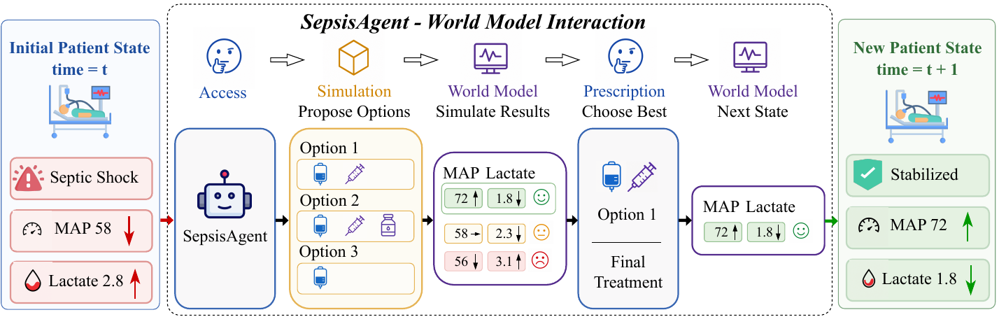
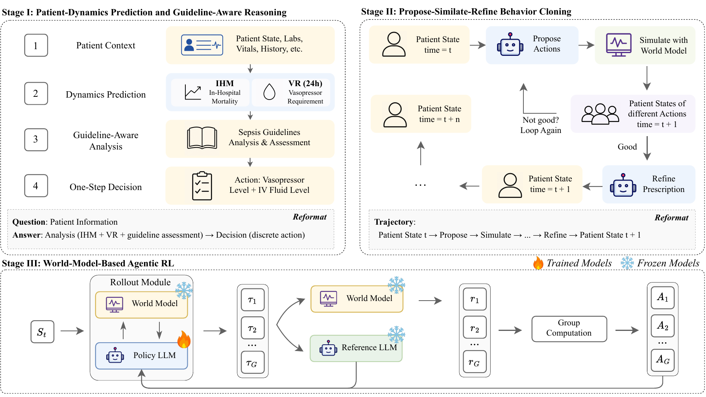

# Agentifying Patient Dynamics within LLMs through Interacting with Clinical World Model

<div align="center">
<h3>
  SepsisAgent
</h3>
</div>

<div align="center">
<h4>
  📃 <a href="https://arxiv.org/abs/2605.14723" target="_blank">Paper</a> ｜ 🤗 <a href="https://huggingface.co/FreedomIntelligence/SepsisAgent-4B" target="_blank">SepsisAgent-4B</a>
</h4>
</div>

## ⚡ Introduction

**SepsisAgent** is a world model-augmented LLM agent for ICU sepsis treatment recommendation. It combines an LLM policy with a learned **Clinical World Model** that simulates patient responses under candidate fluid-vasopressor interventions. Instead of directly outputting a treatment action, SepsisAgent follows a **propose-simulate-refine** workflow: it proposes candidate actions, queries the world model for counterfactual patient trajectories, and refines the final prescription using both simulated dynamics and clinical priors.

The agent is trained with a three-stage curriculum: patient-dynamics supervised fine-tuning, propose-simulate-refine behavior cloning, and world-model-based agentic reinforcement learning. On MIMIC-IV sepsis trajectories, SepsisAgent improves off-policy treatment value while maintaining strong guideline adherence and low unsafe-action rates.

<p align="center">
  
</p>

## 🧠 Method Overview

SepsisAgent uses a Clinical World Model as both an inference-time simulator and a training environment. The world model predicts action-conditioned patient evolution, while the LLM agent learns how to interpret these simulated responses for long-horizon treatment planning.


<p align="center">
  
</p>

## 📊 Main Results

### Clinical World Model Evaluation

| Model Component | Metric | Value |
| --- | ---: | ---: |
| State Transition | MAE | 0.316 |
| State Transition | Ventilation AUC | 0.942 |
| Outcome Prediction | AUC-ROC | 0.804 |
| Outcome Prediction | AUC-PR | 0.663 |

### Policy Value and Safety on MIMIC-IV

Results are reported on the 725-episode held-out test set. Higher is better for DR, WIS, WPDIS, and guideline adherence. Lower is better for unsafe actions.

| Method | DR ↑ | WIS ↑ | WPDIS ↑ | Guideline Adherence ↑ | Underdosing ↓ | Overdosing ↓ |
| --- | ---: | ---: | ---: | ---: | ---: | ---: |
| Clinicians (Test Set) | 5.06 | 5.27 | 10.82 | 94.76 | 0.35 | 0.19 |
| WD3QNE | 8.72 | **12.07** | 23.20 | 87.60 | 1.11 | 1.49 |
| o3 | 8.32 | 9.17 | 20.38 | 90.55 | 0.72 | 1.57 |
| o3 + WM | 9.46 | 10.27 | 22.95 | 96.91 | 0.09 | 0.24 |
| Qwen3-4B-Instruct | 7.79 | 7.34 | 18.76 | 78.00 | 0.62 | 2.13 |
| **SepsisAgent** | **10.01** | 11.14 | **23.40** | **97.95** | **0.08** | **0.14** |

SepsisAgent achieves the best DR and WPDIS scores among evaluated methods, while also obtaining the highest sepsis guideline adherence and the lowest unsafe-action rates. This indicates that the policy-value gains do not come from unsafe treatment shortcuts.

### Ablation Study

| Method | DR ↑ | WIS ↑ | WPDIS ↑ | Guideline Adherence ↑ | Unsafe Actions ↓ | IHM AUROC ↑ | IHM AUPRC ↑ | VR AUROC ↑ | VR AUPRC ↑ |
| --- | ---: | ---: | ---: | ---: | ---: | ---: | ---: | ---: | ---: |
| Qwen3-4B-Instruct | 7.79 | 7.34 | 18.76 | 78.00 | 2.75 | 65.27 | 45.01 | 70.62 | 61.74 |
| SepsisAgent Stage I: SFT | 9.21 | 7.17 | 19.56 | 88.01 | 1.09 | 67.50 | 50.25 | 76.40 | 65.11 |
| SepsisAgent Stage I+II: +BC | 8.99 | 6.81 | 19.61 | 96.89 | 0.51 | 67.55 | 46.63 | 74.56 | 63.70 |
| **SepsisAgent Stage I+II+III: +RL** | **10.01** | **11.14** | **23.40** | **97.95** | **0.22** | **68.52** | **53.45** | **79.96** | **68.83** |

The ablation shows that reinforcement learning in the Clinical World Model environment is the main driver of policy-value improvement. The final stage also improves intrinsic patient-dynamics prediction, including in-hospital mortality (IHM) and 24-hour vasopressor requirement (VR), even without simulator access during evaluation.

## 🚀 Quick Start

### Repository Layout

```
SepsisAgent/
├── inference.py                 # Main agent inference (vLLM + propose-simulate-refine)
├── worldmodel_inference.py      # Standalone Clinical World Model inference demo
├── run_inference.sh             # One-click launcher for the agent demo
├── requirements.txt             # Python dependencies
├── worldmodel/                  # Clinical World Model checkpoints & configs
│   ├── state_model_log.pt       #   - State Model (next-state predictor)
│   ├── outcome.pt               #   - Outcome Model (90-day mortality)
│   ├── scaler_params_log.json   #   - Feature standardization params
│   └── episode_feature_config.json
├── test_data/                   # Single anonymized inference case
│   ├── test_case.pkl            #   - One MIMIC-IV episode (stay_id=37523171)
│   └── real_episode_rewards_test_case.json
├── examples/                    # Worked examples (see examples/README.md)
│   ├── inference_template.json  #   - Full agent rollout (raw JSON)
│   ├── inference_template.md    #   - Same rollout rendered for humans
│   └── worldmodel_inference_example.txt
├── output/                      # Created at runtime (vLLM logs, results)
└── assets/                      # README figures
```

### Installation

```bash
pip install -r requirements.txt
```

> The full MIMIC-IV-derived test set (725 episodes) is not redistributable. We ship a single inference case under `test_data/` that has been derived from a publicly accessible MIMIC-IV stay so the pipeline can be exercised end-to-end.

### 1. Run the World Model alone

The Clinical World Model is a self-contained module: given a patient's history window and a candidate action, it predicts the next-step dynamics, ventilation probability, and (at trajectory end) 90-day mortality.

```bash
# Quick demo (first 5 steps + outcome)
python worldmodel_inference.py --test

# Full trajectory
python worldmodel_inference.py
```

A reference output is provided at `examples/worldmodel_inference_example.txt`.

### 2. Run the full SepsisAgent

The main agent ties the LLM policy together with the World Model via OpenAI tool calling. It auto-launches local vLLM services and runs the propose-simulate-refine loop.

```bash
# Using the bundled launcher
bash run_inference.sh /path/to/SepsisAgent-4B 1

# Or directly
python inference.py \
    --model_path /path/to/SepsisAgent-4B \
    --model_name SepsisAgent-4B \
    --num_gpus 1 \
    --base_port 8000 \
    --test
```

The result JSON (rewards, actions, full multi-turn dialogue) will be written under `output/`. A worked-out reference rollout, including every system / user / tool_call / tool_response message, is provided at `examples/inference_template.md`.

## 🎯 To-Do
- [x] Release the SepsisAgent-4B.
- [x] Release a runnable single-case inference demo (this repo).
- [ ] Upload the data processing scripts.

## 🙏 Acknowledgement

We gratefully acknowledge the [MIMIC Code Repository](https://github.com/MIT-LCP/mimic-code) for providing valuable reference implementations and resources for processing MIMIC critical care data. Our data processing pipeline was developed with reference to this project.

The data used in this work are derived from [MIMIC-IV](https://physionet.org/content/mimiciv/), a publicly available, de-identified electronic health record dataset hosted on PhysioNet.


## 📖 Citation

```
@misc{wu2026sepsisagent,
      title={Agentifying Patient Dynamics within LLMs through Interacting with Clinical World Model}, 
      author={Minghao Wu and Yuting Yan and Zhenyang Cai and Ke Ji and Chuangsen Fang and Ziying Sheng and Xidong Wang and Rongsheng Wang and Hejia Zhang and Shuang Li and Benyou Wang and Hongyuan Zha},
      year={2026},
      eprint={2605.14723},
      archivePrefix={arXiv},
      primaryClass={cs.AI},
      url={https://arxiv.org/abs/2605.14723}, 
}
```
